<p align="center">
  
</p>

<h1 align="center">FireShark Community</h1>

<p align="center">
  <strong>FireShark Community</strong> is a professional technical Q&A and knowledge-sharing platform created for cybersecurity professionals, learners, developers, and technology enthusiasts.
</p>

<p align="center">
  It is designed around a simple idea: make it easy to <strong>ask useful questions, discover high-quality technical knowledge, contribute answers, build reputation, and participate in a well-moderated community</strong>.
</p>

<p align="center">
  <a href="https://community.fireshark.in">
    
  </a>
</p>

<p align="center">
  <strong>Technology:</strong>
</p>

<p align="center">
  
  
  
  
  
  
  
</p>

---

## Table of Contents

- [Project Overview](#project-overview)
- [What the Platform Offers](#what-the-platform-offers)
- [Core Features](#core-features)
- [Community Scope](#community-scope)
- [User Experience](#user-experience)
- [Administration & Moderation](#administration--moderation)
- [Security & Access Control](#security--access-control)
- [SEO & Discoverability](#seo--discoverability)
- [Product Walkthrough & Screenshots](#product-walkthrough--screenshots)
  - [01. Public Entry & Authentication](#01-public-entry--authentication)
  - [02. Account Security & Personal Settings](#02-account-security--personal-settings)
  - [03. Authenticated Community Experience](#03-authenticated-community-experience)
  - [04. Asking, Answering & Discovering Content](#04-asking-answering--discovering-content)
  - [05. Profiles, Reputation & Notifications](#05-profiles-reputation--notifications)
  - [06. Administrator Control Center](#06-administrator-control-center)
  - [07. Moderation & Content Governance](#07-moderation--content-governance)
- [Technology Stack](#technology-stack)
- [Architecture](#architecture)
- [Repository Structure](#repository-structure)
- [Local Development](#local-development)
- [Backend Setup](#backend-setup)
- [Frontend Setup](#frontend-setup)
- [Administrator Setup](#administrator-setup)
- [Development Data](#development-data)
- [Email Configuration](#email-configuration)
- [Production Build](#production-build)
- [Production Deployment](#production-deployment)
- [Authentication & Authorization](#authentication--authorization)
- [Content & Community Management](#content--community-management)
- [Testing](#testing)
- [Documentation](#documentation)
- [Environment Configuration](#environment-configuration)
- [Deployment Checklist](#deployment-checklist)
- [FireShark Ecosystem](#fireshark-ecosystem)
- [Project Positioning](#project-positioning)
- [License & Ownership](#license--ownership)

---

## Project Overview

FireShark Community provides a structured environment for **technical discussions, questions, answers, discovery, and community participation**.

The platform combines traditional Q&A capabilities with a broader community layer covering:

- Questions and answers
- Rich content and code formatting
- Categories and tags
- Voting and accepted answers
- Reputation and badges
- Monthly leaderboards
- Public and authenticated profiles
- Email verification and OTP-based authentication flows
- Search and content discovery
- Real-time notifications
- Community reports and moderation
- Administrative configuration
- SEO-friendly public content

The result is intended to be more than a question board: it is a **structured technical knowledge ecosystem** where contributions can be discovered, evaluated, recognized, and managed at scale.

---

## What the Platform Offers

### For Community Members

Members can participate in the platform by asking questions, writing answers, exploring technical content, following categories and tags, building reputation, earning badges, and maintaining a public technical profile.

### For Moderators & Administrators

Authorized staff receive dedicated management capabilities for users, questions, answers, reports, categories, tags, badges, reputation rules, community settings, and other platform-level controls.

### For the Wider Web

Public technical content is designed to remain discoverable through search engines, with SEO-friendly URLs, metadata, structured data, and sitemap support.

---

## Core Features

| Area | Capabilities |
| --- | --- |
| **Questions & Answers** | Rich editor, code blocks, image uploads, drafts, revisions, slugs, question status, answers, comments, and accepted answers |
| **Voting** | Upvotes, downvotes, duplicate-vote prevention, self-vote protection, and score tracking |
| **Accepted Answers** | Question-author acceptance, staff override, single accepted answer, and solved status |
| **Reputation** | Auditable reputation ledger with configurable rules and contribution-based scoring |
| **Badges** | Criteria-based achievements and manually assigned recognition badges |
| **Leaderboard** | Monthly contributor rankings with historical leaderboard records |
| **Profiles** | Public profiles, reputation, badges, contributions, accepted answers, activity, and verification |
| **Categories & Tags** | Structured content organization and topic-based discovery |
| **Search** | Search across questions, answers, categories, and tags with filtering and pagination |
| **Notifications** | In-app notifications, user preferences, mentions, answers, comments, votes, and achievements |
| **Moderation** | Reports, content review, hiding/restoring, closing/reopening, deletion, suspension, and audit history |
| **Administration** | Dashboard, users, content, categories, tags, badges, reputation rules, leaderboard, and system settings |
| **SEO** | Dynamic metadata, canonical URLs, Open Graph, Twitter metadata, Q&A structured data, sitemap, and `robots.txt` |
| **Security** | Authentication, authorization policies, request validation, rate limiting, content sanitisation, upload validation, and security headers |

---

## Community Scope

The platform is designed primarily around technical and professional subject areas such as:

- Cybersecurity
- Ethical hacking
- Penetration testing
- Bug bounty
- Web and API security
- Networking
- Cloud security
- SOC and Blue Team
- Red Team
- Digital forensics
- Incident response
- Security tools
- Certifications
- Labs and projects
- Cybersecurity careers
- Technical troubleshooting

Content organization is managed through configurable **categories and tags**, allowing the information architecture to evolve without hard-coding every topic into the frontend.

---

## User Experience

The product experience is organized around a clear journey:

1. **Discover** the platform and its technical content.
2. **Create an account** or sign in using the supported authentication flows.
3. **Explore** questions, categories, tags, profiles, and community activity.
4. **Ask** a well-structured technical question.
5. **Answer** questions and contribute practical knowledge.
6. **Interact** through voting, comments, mentions, notifications, and accepted answers.
7. **Build reputation** through meaningful contributions.
8. **Earn recognition** through badges and leaderboard participation.
9. **Maintain a professional profile** that reflects community activity and expertise.

The screenshots in the sections below document this journey from first visit through advanced administrative workflows.

---

## Administration & Moderation

Administrative capabilities are intentionally separated from normal community usage.

Depending on the assigned access level, staff can manage:

- Users
- Questions
- Answers
- Comments
- Categories
- Tags
- Reports
- Badges
- Reputation rules
- Leaderboards
- Notifications
- Global community settings

The administration layer is intended to provide centralized control while keeping normal user-facing experiences focused on participation and discovery.

---

## Security & Access Control

Security is treated as a core application requirement rather than a secondary feature.

The platform includes controls covering:

- Authentication
- Authorization
- Request validation
- CSRF protection
- XSS prevention and content sanitisation
- SQL injection protection
- Rate limiting
- Secure password hashing
- File upload validation
- File size restrictions
- Security headers
- Access control
- Moderation
- Audit logging

Server-side authorization remains the actual security boundary. Frontend restrictions are used for user experience, but they must not be treated as a replacement for backend authorization.

Production environments should use:

```text
APP_ENV=production
APP_DEBUG=false
```

Sensitive credentials and secrets must be supplied through environment configuration and must never be committed to Git.

---

## SEO & Discoverability

Public community content is designed to be discoverable through search engines and social sharing surfaces.

Supported SEO capabilities include:

- Dynamic page titles
- Meta descriptions
- Canonical URLs
- Open Graph metadata
- Social sharing metadata
- XML sitemap
- `robots.txt`
- SEO-friendly slugs
- Q&A structured data
- Indexable public question pages

Individual question pages use structured data appropriate for community Q&A content, helping search engines understand the relationship between questions and answers.

---


# Product Walkthrough & Screenshots

This section provides a **systematic visual tour of FireShark Community**.

All screenshots are loaded from:

```text
docs/screenshots/
```

The sequence intentionally follows the product journey from public discovery and account creation through community participation, personal activity, and privileged administration.

---

## 01. Public Entry & Authentication

### 1. Home Page — Public Experience

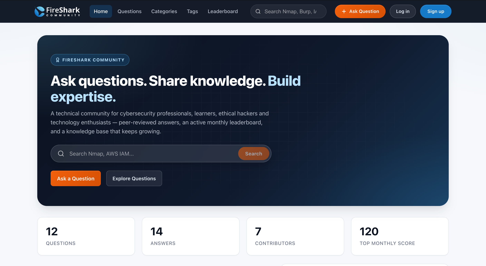

**What this screen demonstrates**

- Establishes the public-facing identity and first impression of FireShark Community.
- Presents the platform as a destination for technical questions, answers, and discovery.
- Acts as the primary entry point for visitors who have not yet authenticated.
- Provides the foundation from which users can move toward questions, categories, tags, authentication, and other public content.
- Demonstrates the overall visual language used across the community experience.

### 2. Login Page

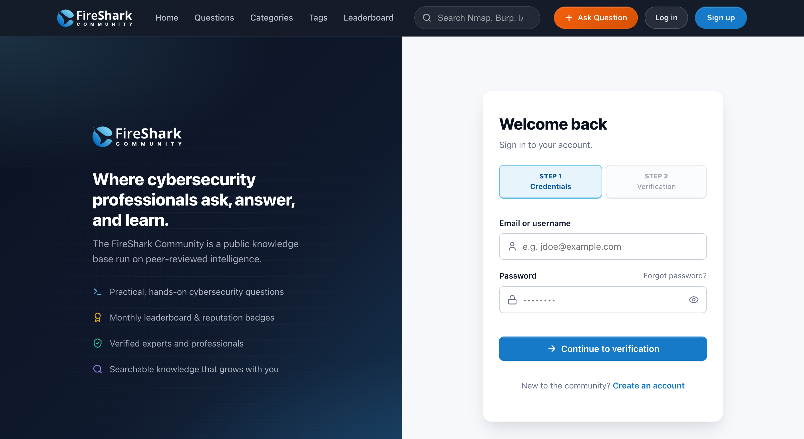

**What this screen demonstrates**

- Provides the dedicated authentication entry point for returning community members.
- Creates a clear transition from public browsing into authenticated functionality.
- Keeps the sign-in experience focused on account access rather than distracting community content.
- Serves as the central gateway to personalized features available after authentication.

### 3. Sign Up Page

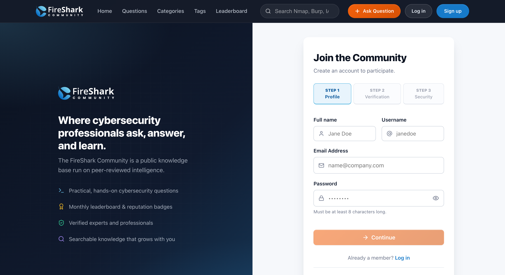

**What this screen demonstrates**

- Introduces the new-user onboarding experience.
- Provides a dedicated registration surface for creating a community account.
- Establishes the account journey before the user can participate in reputation-driven features.
- Separates account creation cleanly from normal question discovery and participation.

### 4. Email Verification Message

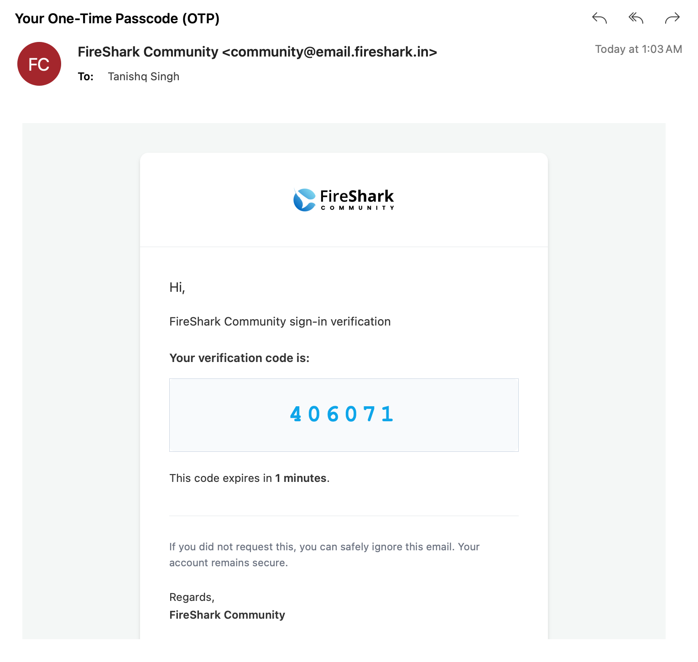

**What this screen demonstrates**

- Illustrates the email verification stage of the account lifecycle.
- Shows that the platform extends authentication beyond a simple form submission.
- Helps reinforce account ownership and verification as part of the onboarding workflow.
- Provides a visible confirmation point between registration and a fully verified account experience.

### 5. Login With Email OTP

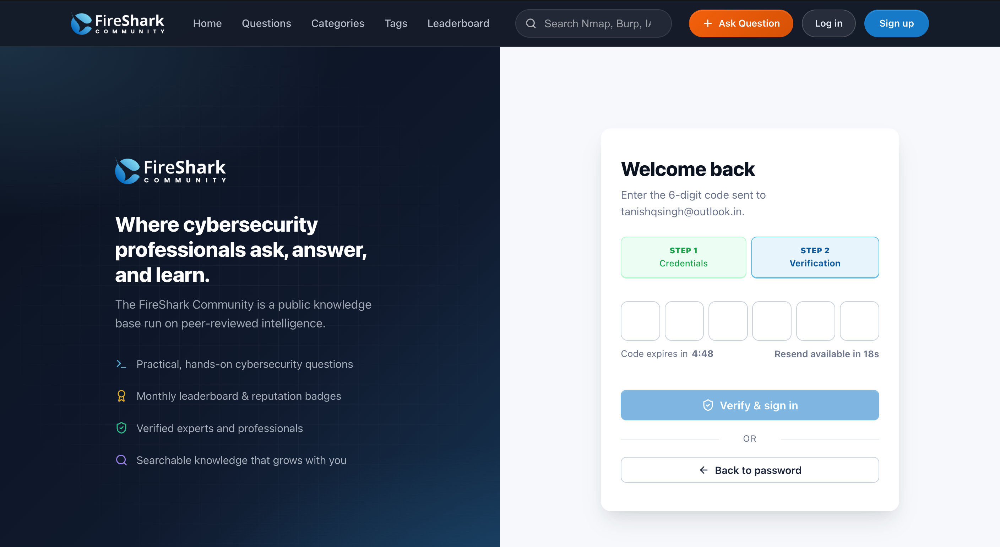

**What this screen demonstrates**

- Documents the email-based OTP authentication flow.
- Highlights an alternate authentication path for users who prefer verification through a one-time code.
- Demonstrates that authentication has been designed with more than one sign-in mechanism in mind.
- Adds another layer to the overall account-access experience.

---

## 02. Account Security & Personal Settings

### 6. Account Settings

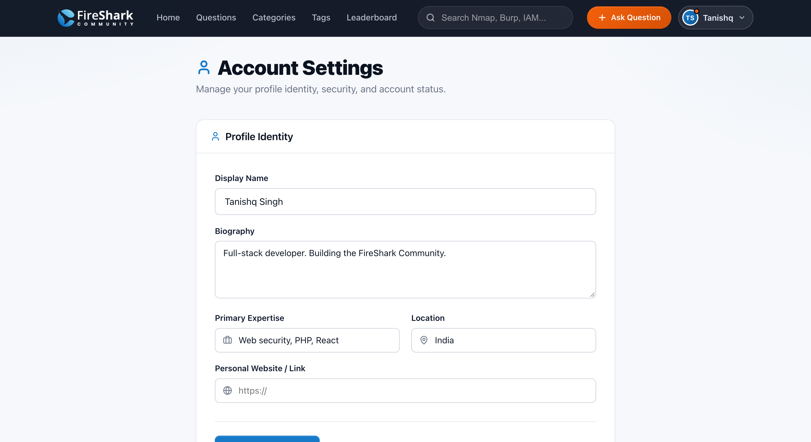

**What this screen demonstrates**

- Centralizes important user-level account configuration.
- Gives authenticated members a dedicated location for maintaining their account information.
- Reinforces the separation between public community activity and private account configuration.
- Acts as the primary personal settings surface for an individual user.

### 7. Security Settings on Accounts

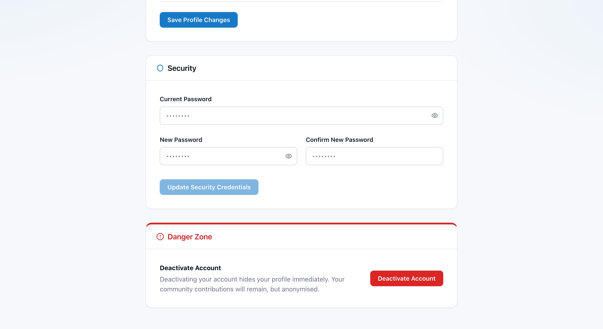

**What this screen demonstrates**

- Focuses specifically on account security controls.
- Provides a dedicated visual checkpoint for security-related configuration.
- Demonstrates that sensitive account functions receive their own settings area rather than being buried inside general profile options.
- Strengthens the overall account-management experience by making security visible and intentional.

### 8. Logged-In Home Page

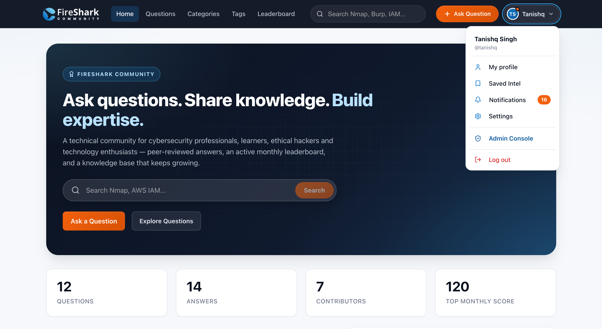

**What this screen demonstrates**

- Shows the transition from public browsing into a personalized authenticated experience.
- Represents the platform as experienced by a signed-in community member.
- Provides the foundation for user-specific participation, discovery, and community activity.
- Highlights the distinction between anonymous public access and authenticated functionality.

---

## 03. Authenticated Community Experience

### 9. Questions Page

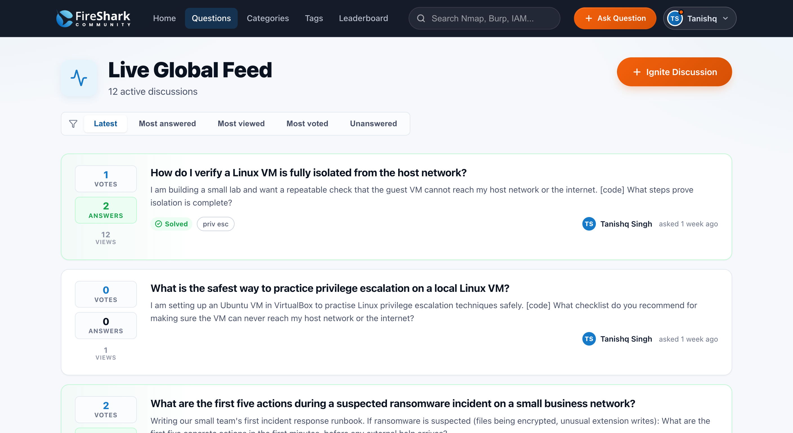

**What this screen demonstrates**

- Presents the broader collection of community questions in an organized browsing experience.
- Gives users a dedicated place to discover discussions rather than relying only on the home page.
- Creates a central information-discovery surface for technical Q&A.
- Supports the core community loop of reading, learning, and choosing a question to open.

### 10. Tags Page

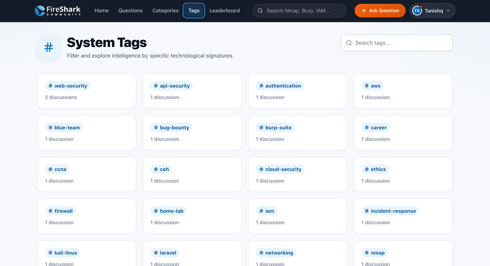

**What this screen demonstrates**

- Exposes the tag taxonomy used to organize technical knowledge.
- Makes topic-based discovery more direct and systematic.
- Helps users move from broad community content toward focused subject areas.
- Demonstrates that content classification is an important part of the platform architecture.

### 11. Categories Page

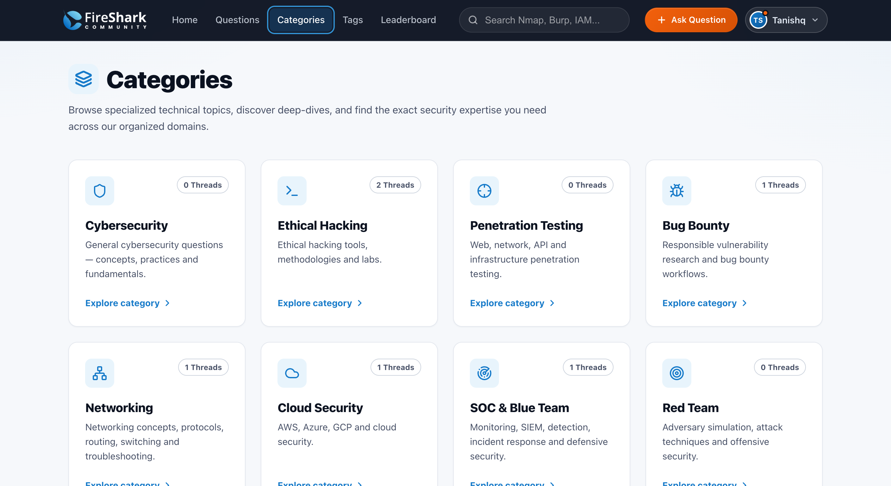

**What this screen demonstrates**

- Provides a higher-level classification layer for community content.
- Helps users browse technical discussions by broader subject groups.
- Complements the more granular tag-based discovery model.
- Demonstrates a two-level organization approach: broad categories combined with detailed tags.

### 12. Explore the Home Page

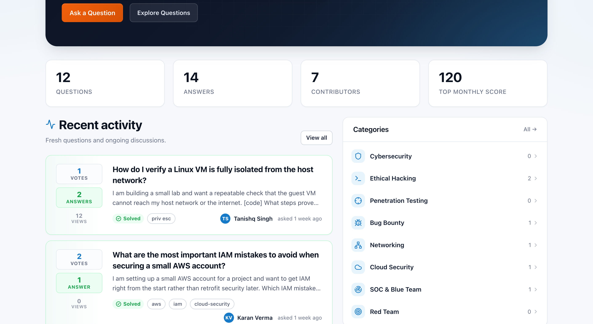

**What this screen demonstrates**

- Shows the broader discovery-oriented experience of the platform.
- Highlights how users can move through community content from a central exploration surface.
- Represents the platform as an active knowledge hub rather than a single-purpose question form.
- Creates a bridge between new visitors, returning users, and deeper technical content.

### 13. Global Search for Questions

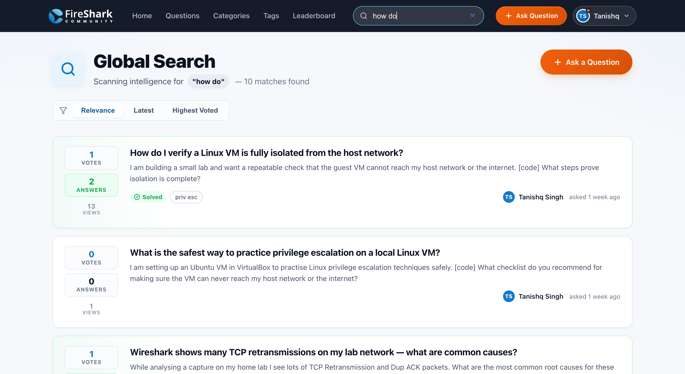

**What this screen demonstrates**

- Documents the global question-search capability.
- Shows how users can move directly from intent to relevant technical content.
- Reduces friction when a user already knows the topic or phrase they want to investigate.
- Supports the platform's goal of turning accumulated community knowledge into a searchable technical resource.

---

## 04. Asking, Answering & Discovering Content

### 14. Ask Question Options

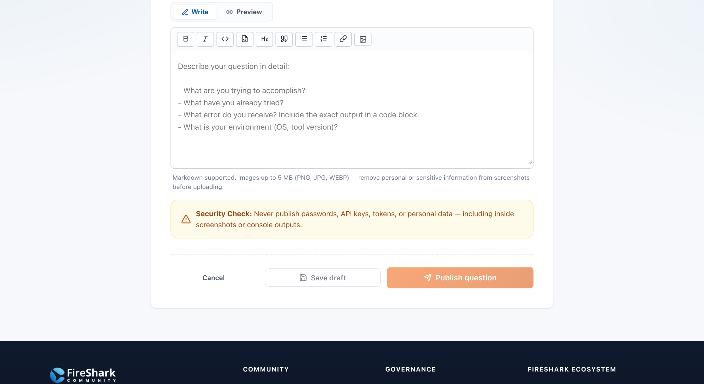

**What this screen demonstrates**

- Shows the entry point for creating a new technical question.
- Establishes the available choices and structure around initiating a question workflow.
- Emphasizes that posting content is an intentional, guided action rather than an unstructured text box.
- Creates a clean bridge from content discovery into content contribution.

### 15. Ask Questions Page

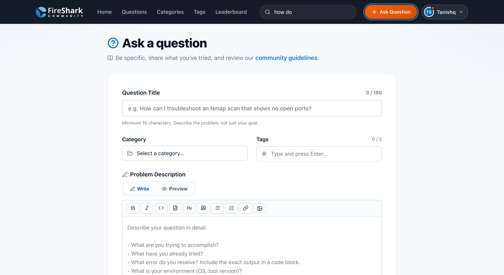

**What this screen demonstrates**

- Presents the dedicated question-composition experience.
- Provides the primary authoring surface for submitting technical questions.
- Represents the point where a community member converts a technical problem or idea into a reusable knowledge artifact.
- Supports the platform's core contribution loop: ask, receive answers, learn, and continue contributing.

### 16. Answer Yourself

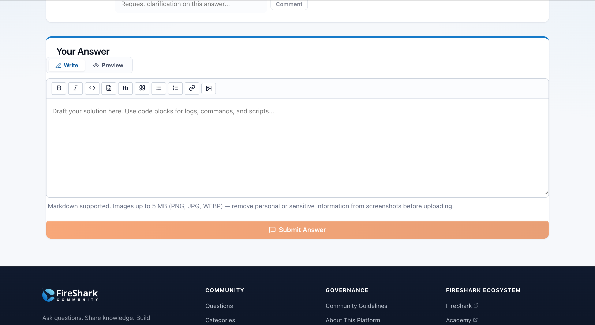

**What this screen demonstrates**

- Documents the ability to contribute an answer within the community experience.
- Highlights the platform's contribution model beyond simply asking questions.
- Reinforces the idea of peer-to-peer technical knowledge sharing.
- Demonstrates how the product supports members who transition from learners into contributors.

### 17. View Any Question

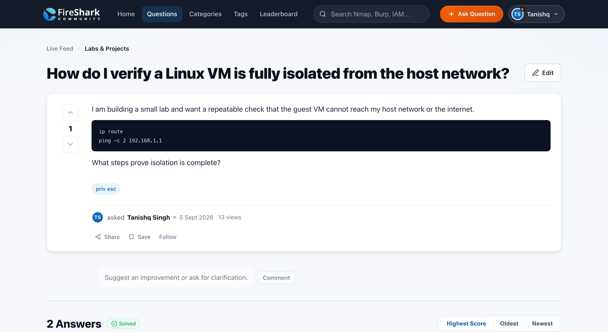

**What this screen demonstrates**

- Presents the individual question detail experience.
- Brings together the technical problem, surrounding interaction, and answer-oriented discussion in one place.
- Represents the core unit of searchable community knowledge.
- Provides the destination where users can read, evaluate, and participate in a specific discussion.

### 18. View Verified Answers

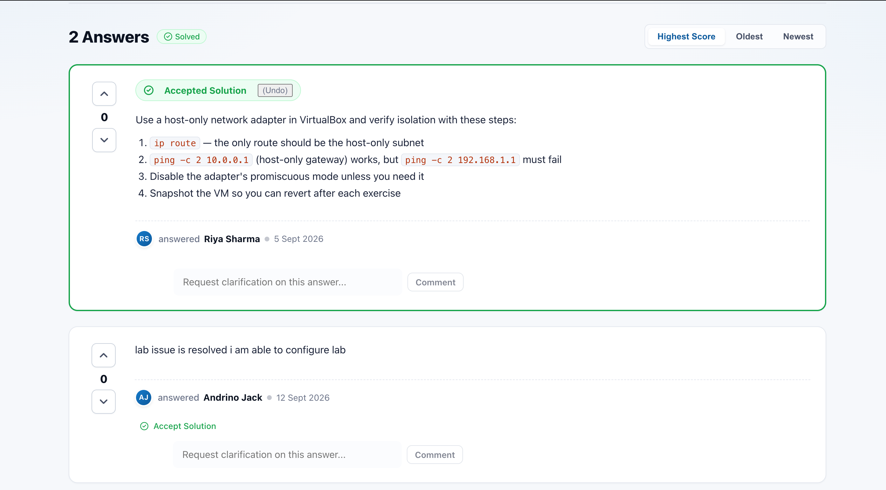

**What this screen demonstrates**

- Highlights the answer-verification aspect of the Q&A experience.
- Helps users quickly identify answers that have received a stronger level of community or author confirmation.
- Strengthens the platform's usefulness as a knowledge resource by making answer quality easier to interpret.
- Connects directly to the platform's accepted-answer and reputation mechanisms.

### 19. Explore Any Category

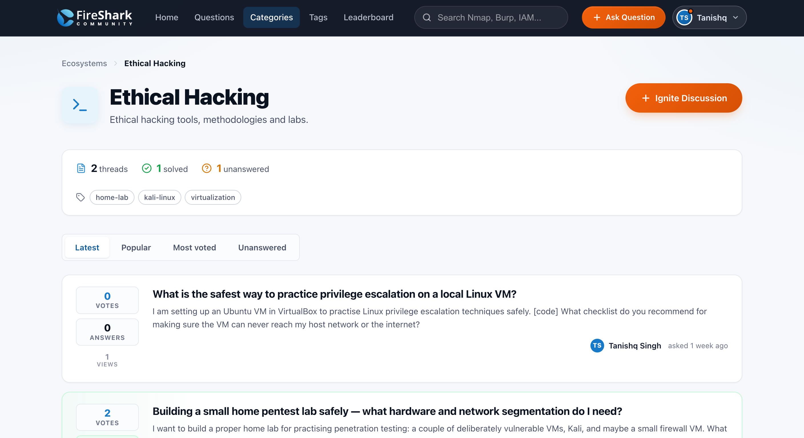

**What this screen demonstrates**

- Shows category-level discovery for users who want to explore a broad technical area.
- Converts category organization into an active browsing workflow.
- Helps users move from a general subject to relevant discussions.
- Demonstrates how structured taxonomy supports content discovery at scale.

### 20. Explore Any Tag

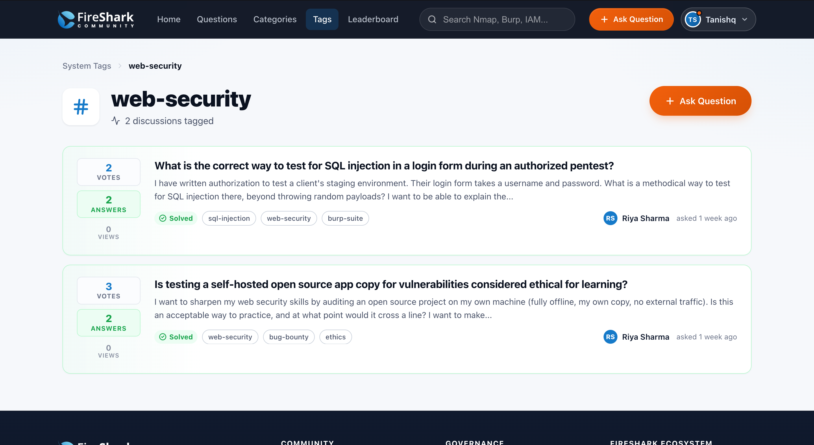

**What this screen demonstrates**

- Shows fine-grained topic discovery through tags.
- Enables users to focus on narrower technical concepts or technologies.
- Complements category-level navigation with more precise filtering.
- Demonstrates the value of a detailed, community-oriented tagging system.

---

## 05. Profiles, Reputation & Notifications

### 21. Check Your Profile

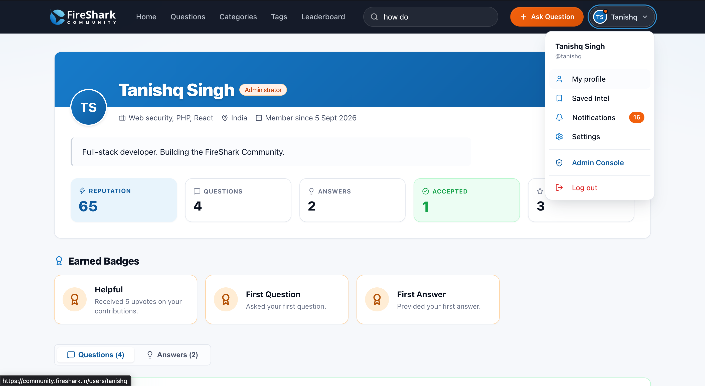

**What this screen demonstrates**

- Presents the authenticated user's own profile view.
- Provides a consolidated representation of community identity and contribution history.
- Creates a central destination for viewing reputation, badges, activity, and profile-related information.
- Helps users understand how their community participation is represented publicly.

### 22. View Anyone's Profile

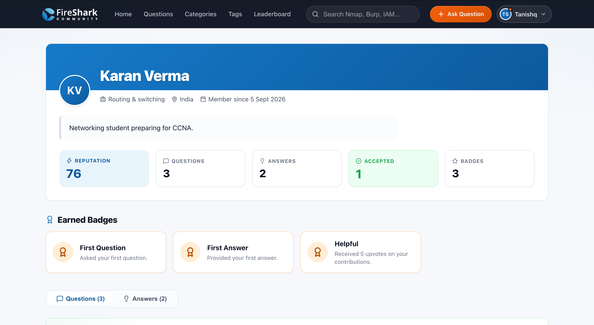

**What this screen demonstrates**

- Demonstrates the public profile model beyond an individual's own account.
- Allows community members to explore the identity and contribution history of other participants.
- Supports trust, recognition, and contributor discovery within the technical community.
- Connects social discovery with measurable community contribution.

### 23. View Full Profile Activities

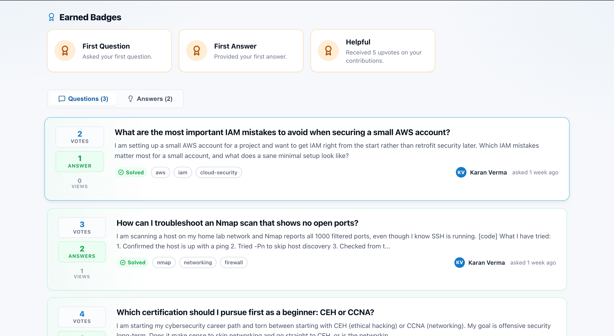

**What this screen demonstrates**

- Provides a deeper activity-oriented perspective on a community profile.
- Makes contribution history more transparent and easier to understand.
- Demonstrates that profiles are not merely static identity pages but records of ongoing participation.
- Helps the community see how knowledge and engagement accumulate over time.

### 24. Leaderboard Page

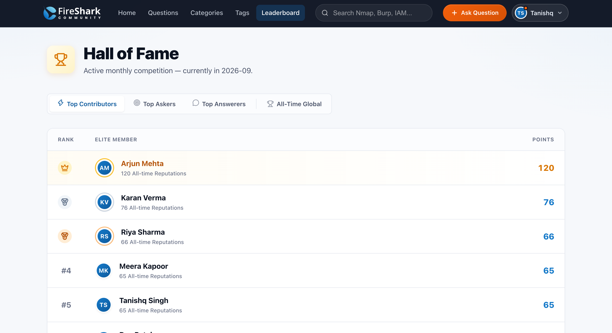

**What this screen demonstrates**

- Presents the community leaderboard experience.
- Surfaces contribution-oriented rankings and recognition mechanisms.
- Connects individual reputation with broader community participation.
- Gives contributors a visible representation of sustained activity within the platform.

### 25. Real-Time Notification Page

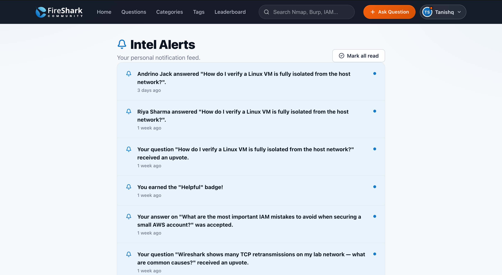

**What this screen demonstrates**

- Documents the in-app notification experience.
- Gives users a central place to see important changes related to their participation.
- Reinforces the platform's ability to keep members connected to community activity.
- Supports interaction-driven experiences around answers, comments, votes, mentions, and achievements.

---

## 06. Administrator Control Center

The following screenshots represent functionality intended for authorized administrators rather than ordinary users.

### 26. Admin Dashboard — Restricted to Administrators

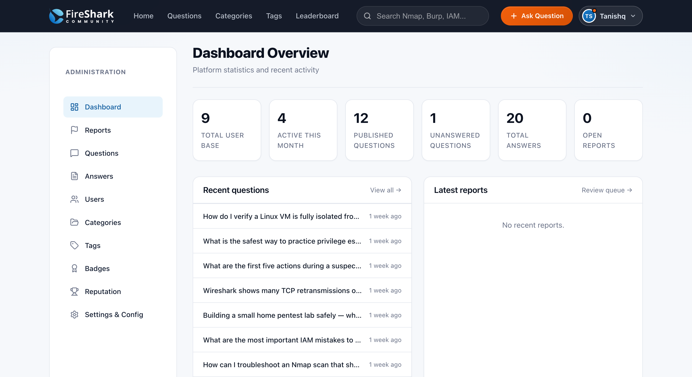

**What this screen demonstrates**

- Shows the dedicated administrative dashboard.
- Makes the separation between normal community functionality and privileged management immediately visible.
- Provides a centralized operational starting point for administrators.
- Represents the control layer used to oversee the wider community platform.

### 27. Settings Configuration by Admin

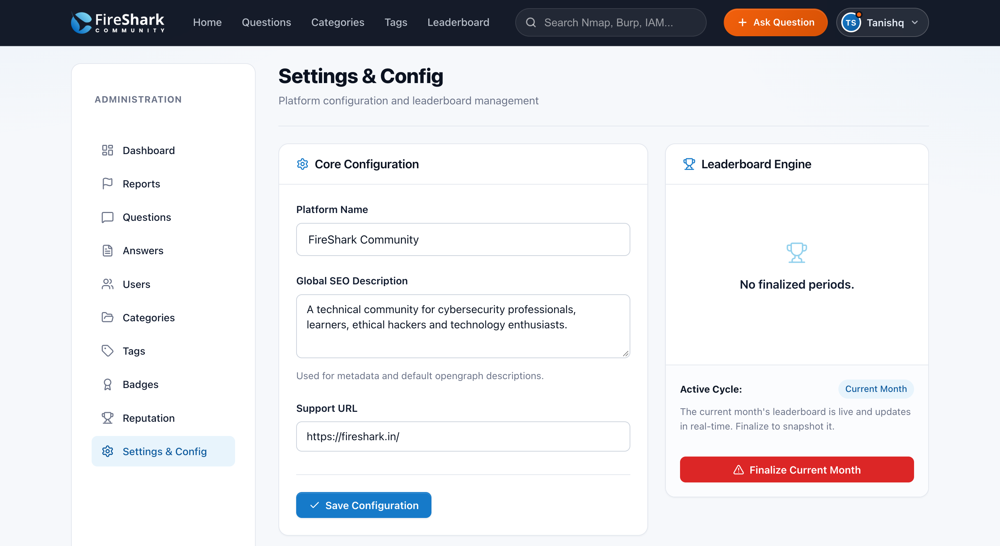

**What this screen demonstrates**

- Documents administrator-controlled platform configuration.
- Shows how global community behavior can be managed from a privileged interface.
- Moves configuration decisions away from hard-coded frontend behavior and into an operational settings layer.
- Provides administrators with a direct mechanism for maintaining platform-wide preferences.

### 28. Manage Categories by Admin

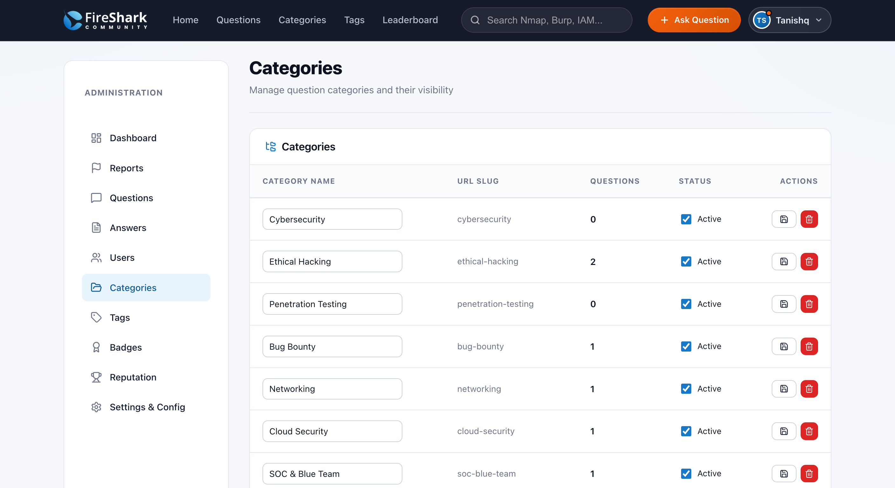

**What this screen demonstrates**

- Shows the administrative management surface for categories.
- Allows the platform's high-level knowledge structure to be maintained without redesigning the frontend.
- Supports ongoing content taxonomy maintenance as the community grows.
- Demonstrates that category organization is treated as managed data rather than a static presentation layer.

### 29. Manage Tags by Admin

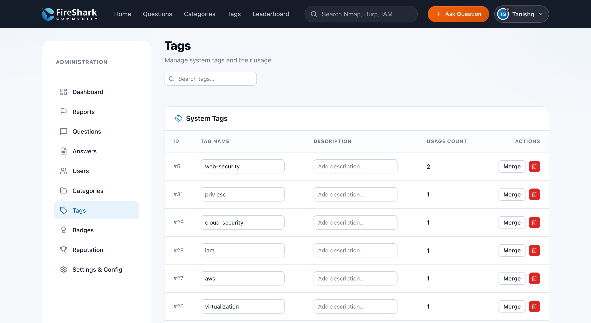

**What this screen demonstrates**

- Documents administrative control over the platform's tag system.
- Helps maintain consistency in topic classification and discoverability.
- Gives administrators the ability to keep the technical taxonomy clean and relevant.
- Supports long-term content organization across a growing knowledge base.

### 30. Manage Badges by Admin

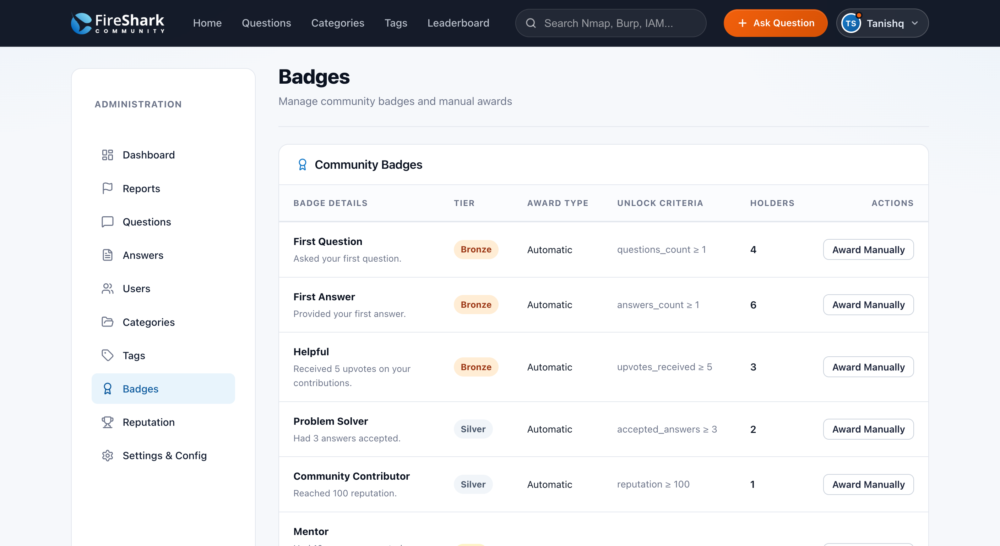

**What this screen demonstrates**

- Shows administrative management of community recognition badges.
- Provides a dedicated place to maintain achievement-oriented recognition.
- Connects platform participation with visible community acknowledgement.
- Helps administrators shape how contributions and milestones are recognized.

### 31. Manage Reputation Rules by Admin

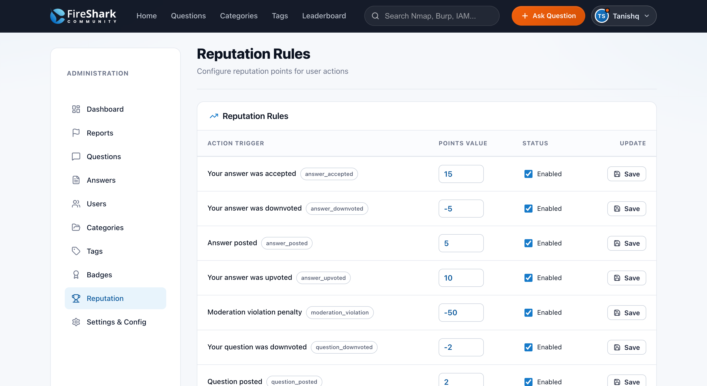

**What this screen demonstrates**

- Documents the administrative reputation-rule configuration experience.
- Shows that reputation is governed through configurable platform rules rather than being treated as an opaque number.
- Creates a centralized mechanism for managing contribution scoring behavior.
- Provides operational control over one of the platform's key community incentives.

### 32. View and Manage Users by Admin

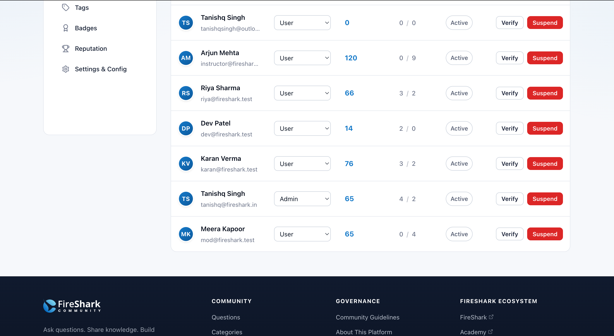

**What this screen demonstrates**

- Presents the administrative user-management experience.
- Gives authorized staff visibility into registered community members.
- Supports operational account management and community governance.
- Establishes users as a first-class administrative resource within the platform.

### 33. View and Manage Questions by Admin

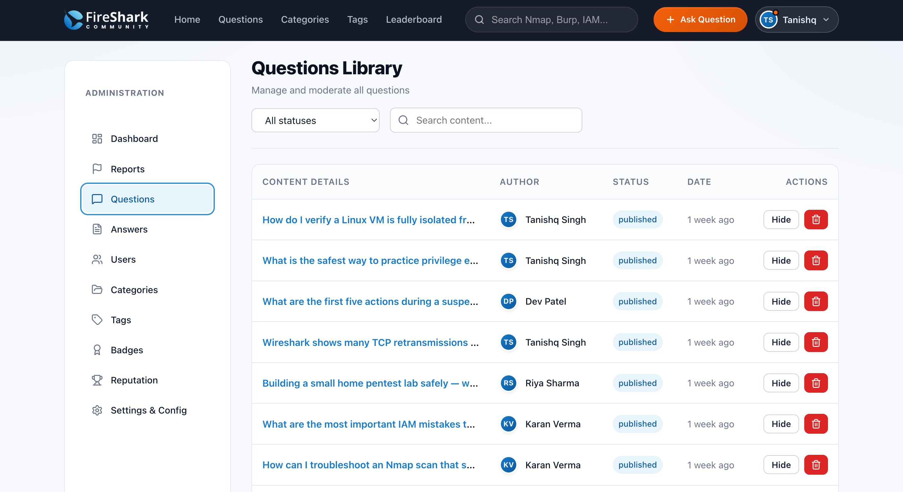

**What this screen demonstrates**

- Shows the administrator's question-management workspace.
- Provides centralized visibility into community-generated questions.
- Supports content oversight at a scale that would not be practical through individual public pages alone.
- Connects question management directly with broader moderation and governance workflows.

### 34. View and Manage Answers by Admin

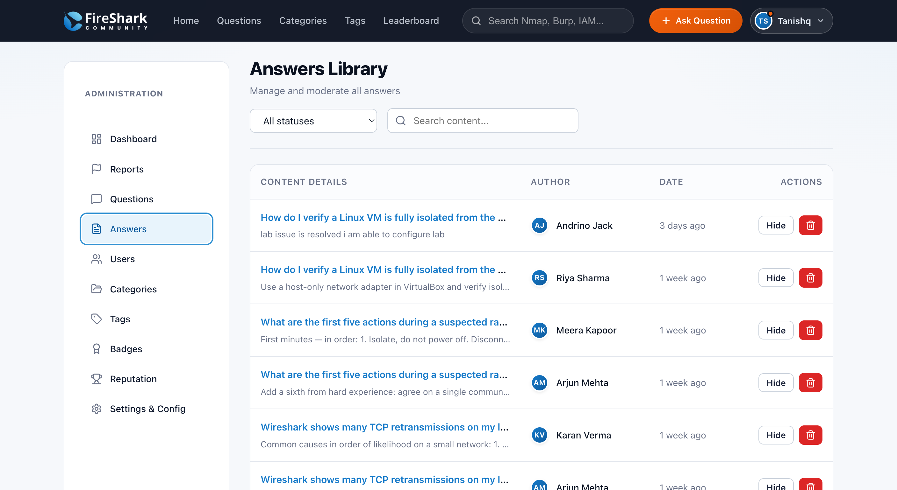

**What this screen demonstrates**

- Documents administrative oversight of submitted answers.
- Gives authorized staff a dedicated management surface for answer content.
- Supports quality, moderation, and policy-oriented review of community contributions.
- Complements the public answer experience with a privileged operational layer.

---

## 07. Moderation & Content Governance

### 35. Remove Any Question by Admin

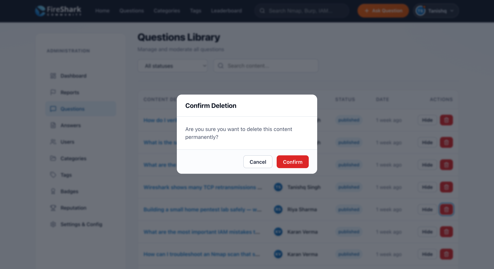

**What this screen demonstrates**

- Shows a privileged moderation action for removing question content.
- Demonstrates that administrators can intervene directly when content requires action.
- Represents the enforcement side of the community-management model.
- Reinforces the principle that public contribution is balanced by administrative governance.

### 36. Report Any Question by Admin

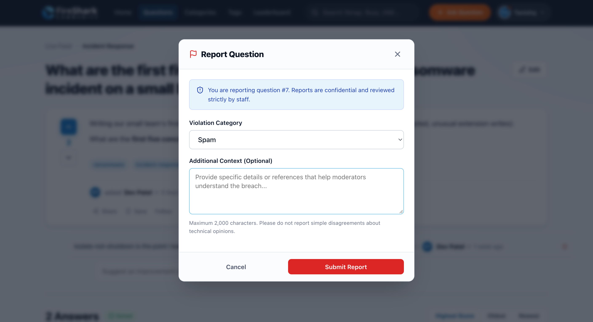

**What this screen demonstrates**

- Documents the administrator-facing capability to report or flag a question from the privileged management workflow.
- Shows how potential policy, quality, or community issues can be surfaced directly from the administrative environment.
- Connects question-level oversight with the broader reporting and moderation lifecycle.
- Reinforces that administrative tooling is designed to support structured intervention rather than informal content handling.

### 37. Review and Manage Reports by Admin

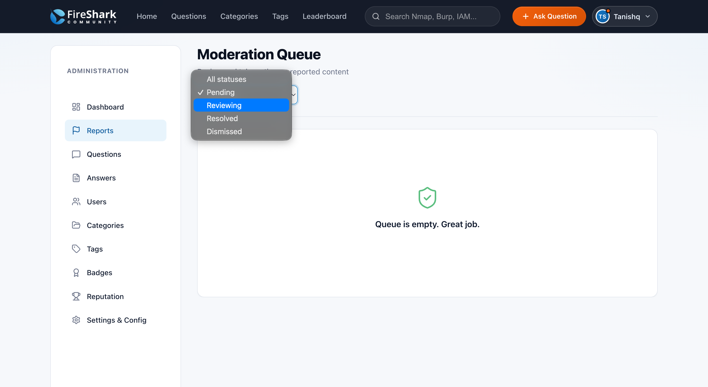

**What this screen demonstrates**

- Provides the administrative review surface for community reports.
- Creates a structured workflow for evaluating reported content rather than relying on ad-hoc intervention.
- Demonstrates the platform's commitment to moderation, accountability, and community governance.
- Acts as the final screenshot in this walkthrough because it represents the operational feedback loop that protects the quality of the wider community experience.

---


## Technology Stack

### Frontend

- **React 19**
- **TypeScript**
- **Vite**
- **React Router**
- REST API integration
- Responsive component-based UI

### Backend

- **Laravel 13**
- **PHP 8.3+**
- RESTful API architecture
- Laravel Sanctum authentication
- Policies and authorization
- Request validation
- Queue and scheduler support where required

### Database

- **MySQL 8+**
- Relational data model
- Foreign-key relationships
- Indexed queries
- Laravel migrations and seeders

### Infrastructure

- **Hostinger** — production hosting
- **Cloudflare** — DNS, proxy, SSL, and edge layer
- **Docker** — optional local development environment

---

## Architecture

The application follows a straightforward full-stack architecture:

```text
                    ┌─────────────────────┐
                    │      Cloudflare     │
                    │   DNS / Proxy / SSL │
                    └──────────┬──────────┘
                               │
                               ▼
                  community.fireshark.in
                               │
                               ▼
                    ┌─────────────────────┐
                    │      Hostinger      │
                    │   Shared Hosting    │
                    └──────────┬──────────┘
                               │
                    ┌──────────┴──────────┐
                    │                     │
                    ▼                     ▼
              React Frontend        Laravel Backend
              Production Build          REST API
                    │                     │
                    └──────────┬──────────┘
                               ▼
                            MySQL
```

### Development Request Flow

```text
React / Vite
localhost:5173
       │
       ▼
Laravel API
localhost:8000
       │
       ▼
MySQL
```

### Production Request Flow

The React application is compiled into a production build and served alongside Laravel so the platform can operate from a single production origin without requiring a continuously running Node.js application server.

---

## Repository Structure

```text
FiresharkCommunity/
│
├── backend/                    # Laravel application
│   ├── app/
│   ├── database/
│   ├── public/
│   ├── resources/
│   ├── routes/
│   ├── storage/
│   └── tests/
│
├── frontend/                   # React + TypeScript application
│   ├── public/
│   ├── src/
│   ├── package.json
│   └── vite.config.*
│
├── docs/                       # Project documentation
│   ├── architecture.md
│   ├── api.md
│   ├── database.md
│   ├── local-development.md
│   ├── testing.md
│   ├── deployment-hostinger.md
│   ├── cloudflare.md
│   ├── security.md
│   ├── administration.md
│   ├── community-rules.md
│   └── screenshots/             # Product screenshots used by this README
│
├── deployment/                 # Production deployment utilities
│
├── docker-compose.yml          # Optional local development services
│
└── README.md
```

---

## Local Development

### Prerequisites

Install the following before starting local development:

- PHP 8.3+
- Composer
- Node.js 20+
- MySQL 8+
- Git

Docker can optionally be used to provide local infrastructure such as MySQL.

---

## Backend Setup

```bash
cd backend

cp .env.example .env

composer install

php artisan key:generate
```

Configure the database connection in `.env`, then run:

```bash
php artisan migrate --seed

php artisan storage:link

php artisan serve
```

Laravel will be available at:

```text
http://localhost:8000
```

---

## Frontend Setup

In a separate terminal:

```bash
cd frontend

npm install

npm run dev
```

The Vite development server will be available at:

```text
http://localhost:5173
```

---

## Administrator Setup

After the backend has been configured, create the initial administrator through the provided Artisan command:

```bash
cd backend

php artisan community:create-admin
```

Follow the interactive prompts to create the initial administrator account.

Administrative routes and capabilities should only be accessible to appropriately authorized users.

---

## Development Data

Development-only sample data can be generated when required:

```bash
php artisan migrate:fresh --seed --seeder=DevelopmentSeeder
```

> **Important:** This command is destructive and should only be used in local development environments.

Production databases must never be reset using destructive migration commands.

---

## Email Configuration

Email functionality is configurable through Laravel's mail configuration.

For local development, the application can use Laravel's log mailer so email messages are recorded in:

```text
backend/storage/logs/laravel.log
```

Email verification requirements can be configured through the application's environment settings.

The authentication screenshots later in this README provide a visual walkthrough of the major email and OTP-related flows.

---

## Production Build

The project includes a production build process:

```bash
./deployment/build-production.sh
```

The build process:

1. Compiles the React application.
2. Places production frontend assets into the Laravel application.
3. Prepares Laravel for production.
4. Optimizes application configuration and routes where applicable.

The resulting application is designed to run from a single production origin:

```text
https://community.fireshark.in
```

---

## Production Deployment

The production environment is designed for deployment on the existing FireShark hosting infrastructure.

### Hosting

**Hostinger** hosts the Laravel application and MySQL database through the FireShark hosting environment.

### Domain

```text
community.fireshark.in
```

### DNS

DNS is managed through **Cloudflare**.

The `community` subdomain should point to the appropriate Hostinger server using the production server address supplied by the hosting environment.

The exact DNS target should be taken from the production environment rather than hard-coded into project documentation.

### SSL

The recommended production configuration is:

```text
Browser
   ↓ HTTPS
Cloudflare
   ↓ HTTPS
Hostinger
```

Cloudflare should use **Full (strict)** SSL when the Hostinger origin has a valid SSL certificate.

Detailed deployment instructions are maintained in:

- [Hostinger Deployment](docs/deployment-hostinger.md)
- [Cloudflare Configuration](docs/cloudflare.md)

---

## Authentication & Authorization

Authentication is handled through Laravel Sanctum.

The platform supports role-based access for:

- **Users**
- **Moderators**
- **Administrators**

Authorization is enforced server-side through Laravel policies and permissions.

Frontend visibility rules are useful for navigation and usability, but backend policies remain responsible for protecting privileged actions and data.

---

## Content & Community Management

The platform provides administrative controls for:

- Users
- Questions
- Answers
- Comments
- Categories
- Tags
- Reports
- Badges
- Reputation rules
- Leaderboards
- Notifications
- Community settings

Moderators can review reported content and take appropriate actions, while administrators have complete platform-level control.

---

## Testing

The project includes automated backend testing and critical application-flow testing.

Coverage includes core functionality such as:

- Authentication
- Authorization
- Questions
- Answers
- Voting
- Accepted answers
- Reputation
- Badges
- Leaderboards
- Notifications
- Reports
- Moderation
- API validation

Run the Laravel test suite with:

```bash
cd backend

php artisan test
```

Frontend and end-to-end testing should also be performed for primary user journeys before every production release.

---

## Documentation

Detailed project documentation is maintained under `docs/`.

| Document | Description |
| --- | --- |
| [Architecture](docs/architecture.md) | Application architecture and request flow |
| [Database](docs/database.md) | Database schema, relationships, indexes, and seeders |
| [API](docs/api.md) | REST API endpoints and request/response structures |
| [Local Development](docs/local-development.md) | Development environment and workflow |
| [Testing](docs/testing.md) | Test strategy and execution |
| [Hostinger Deployment](docs/deployment-hostinger.md) | Production deployment procedure |
| [Cloudflare](docs/cloudflare.md) | DNS, proxy, and SSL configuration |
| [Security](docs/security.md) | Security architecture and review checklist |
| [Administration](docs/administration.md) | Administrator and moderator operations |
| [Community Rules](docs/community-rules.md) | Public community guidelines |

---

## Environment Configuration

Production credentials and secrets must never be committed to Git.

Use:

```text
.env.example
```

as the reference for required environment variables.

A typical production configuration includes:

```env
APP_ENV=production
APP_DEBUG=false
APP_URL=https://community.fireshark.in

DB_CONNECTION=mysql
DB_HOST=
DB_PORT=3306
DB_DATABASE=
DB_USERNAME=
DB_PASSWORD=
```

Actual production values must be configured directly in the hosting environment.

---

## Deployment Checklist

Before going live, verify:

- [ ] Production environment configured
- [ ] `APP_DEBUG=false`
- [ ] MySQL database created
- [ ] Database migrations completed
- [ ] Storage permissions configured
- [ ] React production build generated
- [ ] Laravel production optimizations applied
- [ ] SSL enabled
- [ ] `community.fireshark.in` configured in Hostinger
- [ ] Cloudflare DNS configured
- [ ] Cloudflare SSL configured
- [ ] Authentication tested
- [ ] Question creation tested
- [ ] Answer submission tested
- [ ] Voting tested
- [ ] Notifications tested
- [ ] Moderation tested
- [ ] File uploads tested
- [ ] Sitemap verified
- [ ] Robots configuration verified
- [ ] SEO metadata verified
- [ ] Mobile responsiveness verified
- [ ] Security checks completed
- [ ] Production backups configured

---

---


## FireShark Ecosystem

The community operates as part of the broader FireShark ecosystem:

- **Main Website:** `fireshark.in`
- **Academy:** `academy.fireshark.in`
- **Learning Platform:** `learn.fireshark.in`
- **Technology Platform:** `fireshark.ai`
- **Community:** `community.fireshark.in`

The community is maintained as an independent application while remaining visually and structurally aligned with the wider FireShark ecosystem.

---

## Project Positioning

FireShark Community is built to function as a **long-term technical knowledge platform**, not just a basic CRUD application.

Its architecture combines:

- A modern React-based interface
- A Laravel API and authorization layer
- A relational MySQL data model
- Reputation and recognition mechanics
- Search and structured content discovery
- Notification-driven engagement
- Administrative configuration
- Moderation workflows
- Security controls
- Search-engine-friendly public content

This combination gives the platform a strong foundation for continuous feature expansion while preserving a clear separation between community participation and privileged operational control.

---

## License & Ownership

**Proprietary — FireShark. All rights reserved.**
